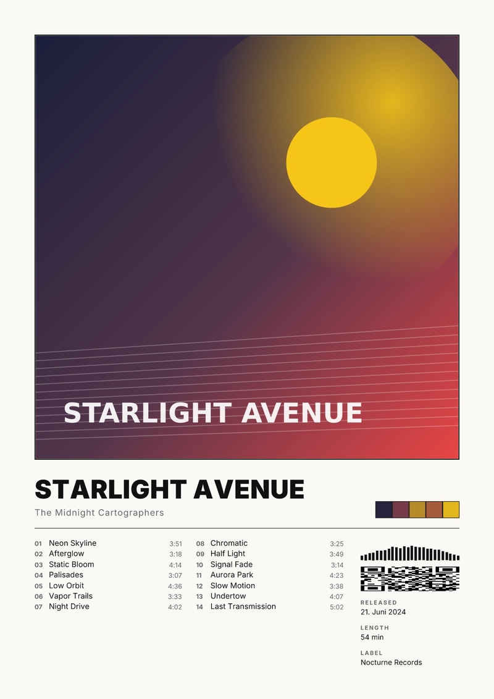

# Posterlab — Album-Poster-Generator

Ein lokales Web-Tool, das aus einem Album automatisch ein druckfertiges Poster
erzeugt („Spotify-Style“): Album suchen, Template wählen, anpassen, als
hochauflösendes PNG oder druckfertiges PDF herunterladen.



## Schnellstart

```bash
npm install
npm run dev        # → http://localhost:3000
```

Das war's — **ohne jede Konfiguration** läuft die App im Deezer-Modus
(Suche + Metadaten ohne API-Key) und mit einem Offline-Demo-Album.

### Optional: Spotify als Datenquelle

Spotify liefert die beste Suche, Laufzeiten in ms, Label und den Scan-Code.

1. Auf https://developer.spotify.com/dashboard eine App anlegen
   (Redirect-URI: `http://localhost:3000` — wird nicht benutzt, ist aber Pflichtfeld)
2. `.env.example` nach `.env.local` kopieren und Client ID/Secret eintragen

Hochauflösende Cover (bis 3000 px) kommen in beiden Modi automatisch über die
**iTunes Search API** (Fallback-Kette 3000 → 2000 → 1400 px, mit
Ähnlichkeitscheck gegen Coverband-Treffer).

### Optional: Direkt-Speichern

`POSTER_OUTPUT_DIR` in `.env.local` setzen (z. B.
`C:\Users\DeinName\Pictures\Poster`) — dann landet jeder Export zusätzlich
direkt in diesem Ordner.

## Features

- **5 Layouts** (Classic, Minimal, Vinyl, Gradient, Square) × **8 Stil-Presets**
  (Classic, Sand, Onyx, Mono, Gallery, Paper, Noir, Bloom) — Layout und Stil
  sind getrennte Achsen, jede Kombination funktioniert
- **4 Typografie-Paare**: Modern (Inter), Serif (Playfair/Source Serif),
  Condensed (Bebas Neue), Mono (Space Mono) — Fonts liegen im Repo
- **14 Formate** von A5 bis A1, US-Formate, Square, 50 × 70 cm, eigene Größe
  (mm/cm/in), bei breiten Formaten wechselt Classic automatisch aufs Square-Layout
- **150 / 300 / 600 DPI** mit Live-Anzeige der Pixelmaße und geschätzten Dateigröße
- **Cover-Qualitätsampel**: effektive PPI des Covers im gewählten Format
  (grün ≥ 250, gelb ≥ 150, rot darunter)
- **Farbpalette aus dem Cover** (Median-Cut mit Sättigungsgewichtung, Dedupe)
- **Waveform** (deterministisch aus Album-ID + Trackdauern — lädt man neu,
  sieht sie gleich aus), **Scan-Code-Element** (Spotify-Logo + Strichmuster,
  rein dekorativ, lokal als Vektor gezeichnet und pro Album deterministisch),
  **Parental-Advisory-Logo** als Vektor (automatisch an, wenn ein Track explizit ist)
- **Tracklist** mit 1–3 Spalten (auto), automatischer Schriftverkleinerung,
  Doppelalbum-Nummerierung (`1-01`), optionalem Entfernen von „(feat. …)“
- **Beschnittzugabe (3 mm) und Schnittmarken**, PDF mit korrekten Seitenmaßen,
  `TrimBox` und `BleedBox`
- **Vorschau = Export**: beide laufen durch dieselbe Layout-Pipeline
  (Satori → SVG → resvg), die Vorschau ist das SVG, der Export das gerasterte PNG
- Konfiguration steckt in der URL (teilbar), Undo/Redo, Zoom-Regler
  (wirkt garantiert nicht auf den Export)
- **Datei-Cache** unter `.cache/`: Album einmal geholt, danach offline verfügbar

## Architektur

```
Browser (Suche → Editor → Export)
   │
   ├─ /api/search        Spotify- oder Deezer-Suche
   ├─ /api/album/[id]    Metadaten + iTunes-Cover-Upgrade + Palette (gecacht)
   ├─ /api/render        eine Pipeline für alles:
   │                       ?mode=svg  → Vorschau (Satori-SVG)
   │                       ?mode=png  → Export (resvg, DPI-genau)
   └─ /api/pdf           PNG in PDF-Seite mit echten mm-Maßen + Trim/BleedBox
```

Die Layout-Logik liegt komplett in `lib/poster.ts` und rechnet **alles relativ
zur Posterbreite** (logische Breite 1000, hochskaliert wird erst beim Rastern).
Stile sind reine Token-Objekte in `lib/styles.ts` — ein neuer Stil ist ~10 Zeilen.

## Wissenswertes

- **Demo-Album**: `Starlight Avenue` (auf der Startseite) funktioniert komplett
  offline — gut zum Ausprobieren der Layouts ohne API-Zugang.
- **Großformate**: A1 bei 600 DPI sind ~278 Megapixel. Das PNG braucht dann
  mehrere GB RAM und 30–60 s (`npm run dev` setzt den Node-Heap schon auf 8 GB).
  Der bessere Weg für A2/A1 ist der **PDF-Export** — der rastert intern mit
  maximal 300 DPI und bleibt klein.
- **600 DPI** bringt für das Foto-Cover nichts (kein Druck löst feiner als
  ~300 PPI auf), es schärft nur Text und Linien — dafür ist PDF der bessere Weg.
- **Scan-Code**: rein dekorativ (Spotify-Logo + Striche im Scan-Code-Look) —
  kein echter Link, kein Netzwerkzugriff, das Muster ist mit der Album-ID
  gesät und damit stabil.
- **Windows**: Projekt nicht in einen OneDrive-Ordner legen, lange Pfade
  aktivieren (`git config --system core.longpaths true`). `cross-env` ist
  bereits eingerichtet. Eine `start.bat` könnte so aussehen:

  ```bat
  @echo off
  cd /d C:\dev\posterlab
  start "" http://localhost:3000
  npm run dev
  ```

- **Rechtliches**: Für den Privatgebrauch (eigene Wand) unproblematisch.
  Album-Cover sind urheberrechtlich geschützt — Verkauf bräuchte Lizenzen,
  und die Spotify-Terms untersagen kommerzielle Nutzung.

## Projektstruktur

```
app/                  Next.js App Router (Suche, Editor, API-Routen)
lib/
  poster.ts           DAS Layout-Modul (alle Layouts, relativ gerechnet)
  styles.ts           8 Stil-Presets als Design-Tokens
  render.ts           Satori → SVG → resvg → PNG, Asset-Aufbereitung
  pdf.ts              PDF mit TrimBox/BleedBox (pdf-lib)
  palette.ts          Median-Cut-Farbextraktion (sharp)
  spotify.ts          Token-Cache + Suche + Album inkl. Tracklist-Paginierung
  deezer.ts           Key-freier Fallback-Provider
  itunes.ts           Hochauflösendes Cover (3000-px-Trick)
  album.ts            Orchestrierung, Cache, Demo-Album
  waveform.ts         deterministische Waveform
  fonts.ts            Font-Buffer für Satori
assets/fonts/         Inter, Playfair, Source Serif, Bebas Neue, Space Mono
.cache/               Datei-Cache (Alben, Cover, Scan-Codes) — gitignored
```
